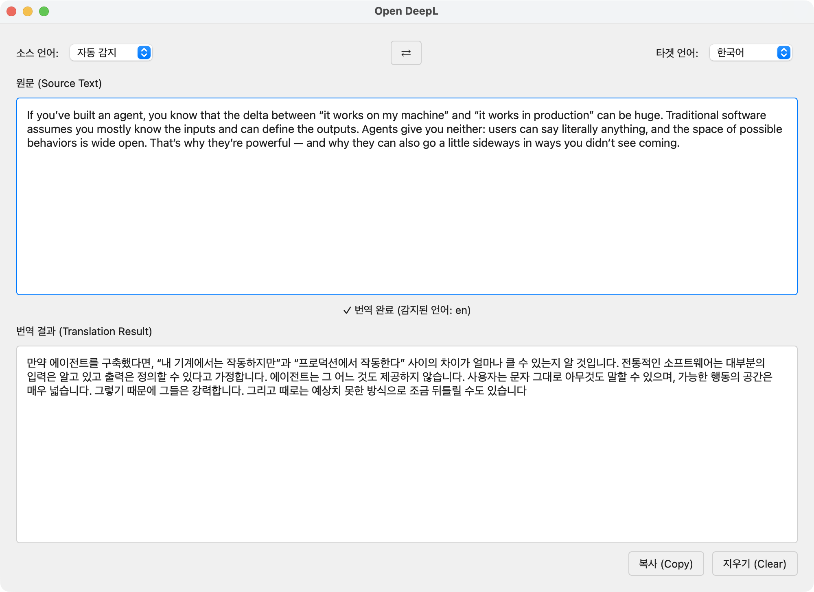

# LocalTranslate - Local Translation Application

로컬 환경에서 동작하는 오픈소스 번역 애플리케이션입니다. Yanolja NEXT Rosetta-4B 모델을 사용하여 프라이버시를 보호하며 오프라인 번역 기능을 제공합니다.



## Features

- 🚀 **Fast Translation**: 500자 미만 텍스트 2초 이내 번역
- 🌍 **10+ Languages**: 한국어, 영어, 일본어, 중국어, 스페인어, 프랑스어, 독일어, 러시아어, 포르투갈어, 이탈리아어
- 🔒 **Offline-First**: 네트워크 없이도 모든 핵심 기능 작동
- 🎨 **Native macOS UI**: PySide6 기반 다크/라이트 모드 지원
- 🧠 **Local AI Model**: Yanolja NEXT Rosetta-4B (4B parameters)
- ⚡ **GPU Acceleration**: Apple Silicon MPS 지원

## System Requirements

- **OS**: macOS 11.0 이상
- **RAM**: 8GB 이상
- **Storage**: 10GB 여유 공간
- **Python**: 3.11 이상

## Quick Start

### 1. Installation

```bash
# Clone repository
git clone <repository-url>
cd local-translate

# Install uv (if not installed)
curl -LsSf https://astral.sh/uv/install.sh | sh

# Install dependencies
uv pip install -e .
```

### 2. First Run

```bash
# Run the application
python src/main.py
```

첫 실행 시 모델 다운로드 (~8GB)가 진행됩니다. 스플래시 화면에서 진행 상황을 확인할 수 있습니다.

### 3. Usage

1. **텍스트 입력**: 원문 텍스트 박스에 번역할 텍스트 입력
2. **자동 번역**: 언어가 자동 감지되고 번역 결과 표시
3. **결과 복사**: "복사" 버튼 또는 `Cmd+C`로 번역 결과 복사

## Development

### Setup Development Environment

```bash
# Install with dev dependencies
uv pip install -e ".[dev]"

# Install pre-commit hooks (optional)
pre-commit install
```

### Running Tests

```bash
# Run all tests
pytest

# Run unit tests only
pytest tests/unit/

# Run with coverage
pytest --cov=src --cov-report=html

# Run performance benchmarks
pytest tests/performance/ --benchmark-only
```

### Code Quality

```bash
# Format code
black src/ tests/

# Lint code
ruff check src/ tests/

# Type check
mypy src/

# Run all quality checks
black src/ tests/ && ruff check src/ tests/ && mypy src/
```

## Architecture

```
local-translate/
├── src/
│   ├── core/           # Business logic (translation, detection, config)
│   ├── ui/             # PySide6 UI components
│   ├── macos_platform/ # macOS-specific integrations
│   └── utils/          # Shared utilities
├── tests/
│   ├── unit/           # Unit tests
│   ├── integration/    # Integration tests
│   └── performance/    # Performance benchmarks
└── resources/          # App resources (icons, translations)
```

## Keyboard Shortcuts

- `Cmd+C` - Copy translation result
- `Cmd+Q` - Quit application
- `Cmd+W` - Close window
- `Cmd+,` - Open preferences (future feature)

## Performance

- **Translation Speed**: <2s for <500 chars, <5s for 500-2000 chars
- **Startup Time**: <3s to show UI
- **Memory Usage**: <500MB during normal operation
- **Language Detection**: <100ms overhead

## Troubleshooting

### Model Loading Fails

```bash
# Clear model cache
rm -rf ~/.cache/huggingface/

# Re-run application
python src/main.py
```

### Memory Issues

모델 로딩 시 메모리 부족 발생 시:

1. 다른 애플리케이션 종료
2. 최소 8GB RAM 확인
3. INT8 양자화가 올바르게 적용되었는지 확인

### Translation Errors

- 입력 텍스트가 2000자 이하인지 확인
- 지원되는 언어 조합인지 확인
- 로그 파일 확인: `logs/translation.log`

## Contributing

1. Fork the repository
2. Create feature branch (`git checkout -b feature/amazing-feature`)
3. Commit changes (`git commit -m 'Add amazing feature'`)
4. Push to branch (`git push origin feature/amazing-feature`)
5. Open Pull Request

## License

MIT License - see [LICENSE](LICENSE) file for details

## Acknowledgments

- Translation Model: [Yanolja NEXT Rosetta-4B](https://huggingface.co/yanolja/YanoljaNEXT-Rosetta-4B)
- Language Detection: [lingua-py](https://github.com/pemistahl/lingua-py)
- UI Framework: [PySide6](https://wiki.qt.io/Qt_for_Python)

## Support

For issues and questions:
- GitHub Issues: <repository-url>/issues
- Documentation: `docs/` directory

---

**Note**: This application uses a large AI model (~8GB). Ensure sufficient disk space and RAM before installation.
